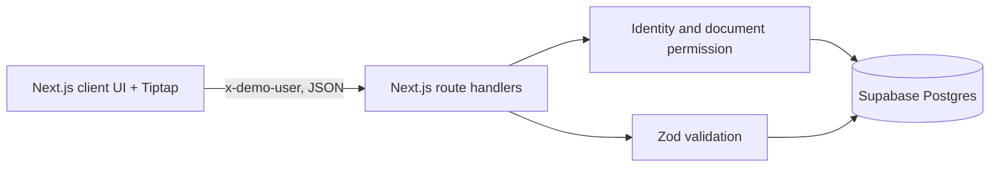

# Ajaia Docs architecture

## Product goal

Provide a reviewer-friendly collaborative editing loop within a 4–6 hour take-home scope. The product is persistent and shareable, but intentionally asynchronous.

## Responsibilities

The frontend holds the selected demo identity in localStorage, renders the dashboard and Tiptap editor, validates import size/extension, and shows save and API errors. Route handlers validate the selected seeded identity, enforce document permission, validate mutations, and perform all privileged database access. The browser never receives the Supabase secret.

## Data and authorization

`app_users` contains three deterministic seeded users. `documents` holds title, Tiptap JSON, owner, and timestamps. `document_shares` has one `editor` row per document/user pair. The server's shared policy helper resolves `owner`, `editor`, or no permission. It returns 403 for an unrelated user and 404 for a missing document. Owner-only checks protect title changes and every sharing operation. Content edits permit owner and editor. RLS is enabled; the trusted server key bypasses it for this demo. Production should use signed sessions or Supabase Auth plus RLS policies based on authenticated user IDs.

## Persistence and editor

Tiptap JSON is stored in `jsonb`, preserving marks and nodes without accepting uploaded HTML. Content changes debounce for 700 ms and save with a PATCH. Blur flushes recent changes. A serialized in-flight save prevents a later edit from being silently replaced by an earlier request. Save status is visible. Separate browsers editing the same document still use last-write-wins; conflict detection/versioning should precede any real-time CRDT work.

## Import and errors

The browser accepts `.txt` up to 1 MB, reads it as text, converts paragraphs to Tiptap JSON, then creates a standard document through the API. Zod checks create, update, and share bodies. API errors use clear status codes; the UI shows failures instead of a blank view. Missing Supabase configuration returns a readable server error.

## Testing and deployment

Vitest covers the production authorization policy for owner, explicitly shared editor, and unrelated user. TypeScript, ESLint, and a production build check the rest of the code. Runtime database QA requires a configured Supabase project. Vercel hosts the Next.js app; Supabase hosts persistent data. Environment variables stay server-side.

## Tradeoffs and next steps

Seeded identities make sharing easy to review but are spoofable. There are no comments, suggestions, version history, DOCX parsing, WebSockets, or live cursors. The next engineering steps are database-backed route integration tests, document version checks for concurrent writes, and then evaluation of Yjs/Hocuspocus if live simultaneous editing becomes necessary.
